# <p align=center> Multimodal Representation Learning under Imperfect Data Conditions: A Survey </p>
<p align=center> Authors: Muhamamd Irzam Liaqat, Qaiser Abbas, Shah Nawaz, Muhammad Zaigham Zaheer, Marta Moscati, Yufang Hou, Muhammad Haris Khan, Salman Khan, Elisabeth Andre, Markus Schedl </p> 

<p align="center">
  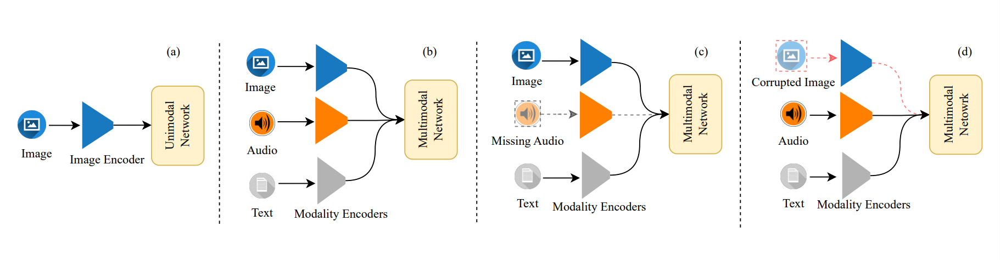</br>
  <em>Fig 1:  Abstract Overview of different type of learning.(a). Unimodal Learning (b). Multimodal Learning (c). Multimodal Learning under Missing Modalities (d). Multimodal Learning under Corrupted Modalities</em>
</p>

<p align="center">
  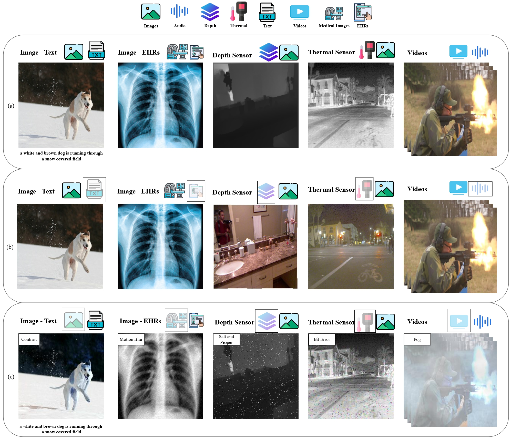</br>
  <em>Fig 2: Use-cases of data corruptions in real world. (a) Multimodal Learning (b) Multimodal Learning with missing modalities (c) Multimodal Learning with Corrupted Modalities</em>
</p>

We strongly encourage the contributors/researchers to contribute to the research community in this specific research area. To add latest papers just make pull request to update the new paper's information!

## Table of Contents
<!-- - [Existing Surveys](#existing-survey-paper) -->


<!-- - [Multimodal Representation Learning under Imperfect Data Conditions: A Survey](#-p-aligncenter-multimodal-representation-learning-under-imperfect-data-conditions-a-survey--p) -->
  - [Existing Survey Paper](#existing-survey-paper-back-to-top)
  - [Multimodal Learning with Missing Modalities](#multimodal-learning-with-missing-modalities-back-to-top)
    - [1.1 Reconstruction](#11-reconstruction)
      - [1.1.1 Generative](#111-generative-back-to-top)
      - [1.1.2 Alignment](#112-alignment-back-to-top)
    - [1.2 Architectural](#12-architectural)
      - [1.2.1 Model Design](#121-model-design-back-to-top)
      - [1.2.2 Selective Fusion](#122-selective-fusion-back-to-top)
      - [1.2.3 Co-Learning](#123-co-learning-back-to-top)
      - [1.2.4 Distillation](#124-distillation-back-to-top)
      - [1.2.5 Attention Mechanism](#125-attention-mechanism-back-to-top)
      - [1.2.6 Prompt Learning](#126-prompt-learning-back-to-top)
    - [1.3 Hybrid Appraoches](#13-hybrid-appraoches-back-to-top)
  - [Multimodal Learning with Corrupted Modalities](#multimodal-learning-with-corrupted-modalities-back-to-top)
    - [2.1 Data Processing Methods](#21-data-processing-methods-back-to-top)
      - [2.1.1 Denoising Methods](#211-denoising-methods-back-to-top)
      <!-- - [2.1.2 Signal Restoration Methods](#212-signal-restoration-methods-back-to-top) -->
    - [2.2 Architectural Methods](#22-architectural-methods)
      - [2.2.1 Noise Aware Networks](#221-noise-aware-networks-back-to-top)
      - [2.2.2 Confidence Estimation](#222-confidence-estimation-back-to-top)
      - [2.2.3 Robust Fusion](#223-robust-fusion-back-to-top)
    - [2.3 Training Strategies](#23-training-strategies)
      - [2.3.1 Data Augmentation](#231-data-augmentation-back-to-top)
      - [2.3.2 Adversarial Training](#232-adversarial-training-back-to-top)
    - [2.4 Post Hoc Methods](#24-post-hoc-methods)
      - [2.4.1 Error Detection](#241-error-detection-back-to-top)
      - [2.4.2 Recovery Mechanism](#242-recovery-mechanism-back-to-top)
  - [License](#license)
  - [Citation](#citation)


## Existing Survey Paper [Back to Top](#table-of-contents)

| Year | Title | Paper Link | Code Link|
|------|-------|-------|------|
| 2024 | Deep multimodal learning with missing modality: A survey | [📄 Link](http://arxiv.org/pdf/2409.07825v3) | - |
| 2024 | Multimodal fusion on low-quality data: A comprehensive survey | [📄 Link](https://arxiv.org/pdf/2404.18947.pdf) | - |
| 2023 | Multimodal learning with transformers: A survey | [📄 Link](http://arxiv.org/pdf/2206.06488v2) | - |
| 2022 | A survey on deep multimodal learning for computer vision: advances, trends, applications, and datasets | [📄 Link](https://link.springer.com/article/10.1007/s00371-021-02166-7) | - |
| 2020 | A survey on deep learning for multimodal data fusion | [📄 Link](https://direct.mit.edu/neco/article/32/5/829/95591/A-Survey-on-Deep-Learning-for-Multimodal-Data) | - |
| 2019 | Deep multimodal representation learning: A survey | [📄 Link](https://ieeexplore.ieee.org/ielx7/6287639/8600701/08715409.pdf) | - |
| 2018 | Multimodal machine learning: A survey and taxonomy | [📄 Link](http://arxiv.org/pdf/1705.09406v2) | - |
| 2010 | Multimodal fusion for multimedia analysis: a survey | [📄 Link](https://link.springer.com/article/10.1007/s00530-010-0182-0) | - |

## Multimodal Learning with Missing Modalities [Back to Top](#table-of-contents)

<p align="center">
  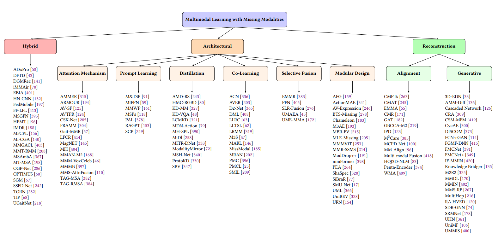</br>
  <em>Fig 3:  Overview of our missing modality taxonomy with SOTA methods Modalities</em>
</p>

<p align="center">
  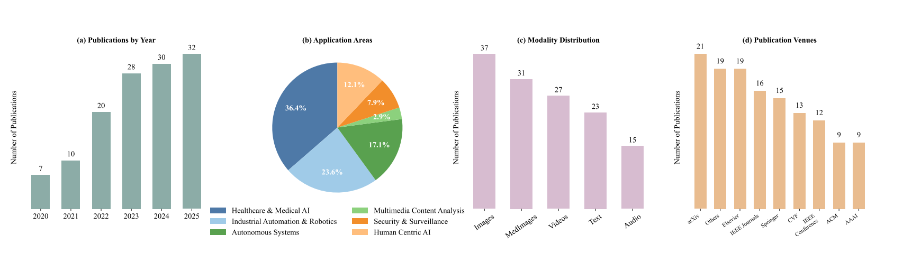</br>
  <em>Fig 4: Overview of the existing studies on multimodal learning under missing modalities, showing (a) yearly publication trends, (b) application areas, (c) modality distribution, and (d) publication venues</em>
</p>

### 1.1 Reconstruction 
<!-- Generative Appraoches -->
#### 1.1.1 Generative [Back To Top](#table-of-contents)
<p align="center">
  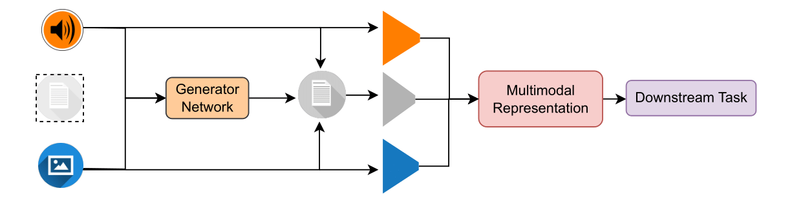</br>
  <em>Fig 5: High level overview of generative methods for missing modality handling</em>
</p>

| Year | Title | Paper Link | Code Link |
|------|-------|------------|-----------|
| 2025 | Knowledge Bridger: Towards Training-Free Missing Multi-Modality Completion | [📄](https://arxiv.org/abs/2502.19834) | [💻](https://github.com/Guanzhou-Ke/Knowledge-Bridger) |
| 2025 | Multimodal Cascaded Framework With Multimodal Latent Loss Functions Robust To Missing Modalities | [📄](https://dl.acm.org/doi/10.1145/3711860) | - |
| 2025 | Sdr-Gnn: Spectral Domain Reconstruction Graph Neural Network For Incomplete Multimodal Learning In Conversational Emotion Recognition | [📄](http://arxiv.org/pdf/2411.19822v1) | - |
| 2025 | Amm-Diff: Adaptive Multi-Modality Diffusion Network For Missing Modality Imputation | [📄](https://arxiv.org/abs/2501.12840) | - |
| 2024 | Fmcnet $+ $: Feature-Level Modality Compensation For Visible-Infrared Person Re-Identification | [📄](https://ieeexplore.ieee.org/document/9880449) | - |
| 2024 | Unified Multi-Modal Image Synthesis For Missing Modality Imputation | [📄](https://arxiv.org/pdf/2304.05340) | - |
| 2024 | Deformation-Aware And Reconstruction-Driven Multimodal Representation Learning For Brain Tumor Segmentation With Missing Modalities | [📄](https://www.sciencedirect.com/science/article/abs/pii/S1746809424000703) | [💻](https://github.com/Linzy0227/SRMNet) |
| 2024 | Do We Really Need To Drop Items With Missing Modalities In Multimodal Recommendation? | [📄](http://arxiv.org/pdf/2408.11767v1) | - |
| 2023 | Unimf: A Unified Multimodal Framework For Multimodal Sentiment Analysis In Missing Modalities And Unaligned Multimodal Sequences | [📄](https://ieeexplore.ieee.org/document/10339893) | [💻](https://github.com/gw-zhong/UniMF) |
| 2023 | Learning Unified Hyper-Network For Multi-Modal Mr Image Synthesis And Tumor Segmentation With Missing Modalities | [📄](https://ieeexplore.ieee.org/document/10209227) | [💻](https://github.com/HeranYang/hyper-GAE) |
| 2023 | Exploiting Modality-Invariant Feature For Robust Multimodal Emotion Recognition With Missing Modalities | [📄](https://arxiv.org/pdf/2210.15359) | - |
| 2022 | M2R2: Missing-Modality Robust Emotion Recognition Framework With Iterative Data Augmentation | [📄](https://arxiv.org/pdf/2205.02524) | - |
| 2022 | Region-Of-Interest Attentive Heteromodal Variational Encoder-Decoder For Segmentation With Missing Modalities | [📄](https://link.springer.com/chapter/10.1007/978-3-031-26351-4_9) | [💻](https://github.com/ssjx10/RA-HVED) |
| 2022 | Fmcnet: Feature-Level Modality Compensation For Visible-Infrared Person Re-Identification | [📄](https://ieeexplore.ieee.org/document/9880449) | - |
| 2021 | Semi-Supervised Multimodal Image Translation For Missing Modality Imputation | [📄](https://ieeexplore.ieee.org/document/9413461) | - |
| 2021 | Brain Tumor Segmentation For Missing Modalities By Supplementing Missing Features | [📄](https://ieeexplore.ieee.org/document/9442533) | - |
| 2021 | Feature-Enhanced Generation And Multi-Modality Fusion Based Deep Neural Network For Brain Tumor Segmentation With Missing Mr Modalities | [📄](https://www.sciencedirect.com/science/article/am/pii/S0925231221013904) | - |
| 2021 | Glioblastoma Multiforme Prognosis: Mri Missing Modality Generation, Segmentation And Radiogenomic Survival Prediction | [📄](http://arxiv.org/pdf/2104.01149v2) | - |
| 2021 | Missing Modality Imagination Network For Emotion Recognition With Uncertain Missing Modalities | [📄](https://aclanthology.org/2021.acl-long.203.pdf) | - |
| 2020 | Optimal Sparse Linear Prediction For Block-Missing Multi-Modality Data Without Imputation | [📄](https://www.ncbi.nlm.nih.gov/pmc/articles/PMC8612700) | - |
| 2020 | Estimation Of Missing Values In Heterogeneous Traffic Data: Application Of Multimodal Deep Learning Model | [📄](https://www.sciencedirect.com/science/article/abs/pii/S0950705120300691) | - |
| 2018 | Synthesizing And Reconstructing Missing Sensory Modalities In Behavioral Context Recognition | [📄](https://www.mdpi.com/1424-8220/18/9/2967) | - |
| 2018 | Deep Adversarial Learning For Multi-Modality Missing Data Completion | [📄](https://dl.acm.org/doi/pdf/10.1145/3219819.3219963) | - |
| 2017 | Missing Modalities Imputation Via Cascaded Residual Autoencoder | [📄](https://openaccess.thecvf.com/content_cvpr_2017/papers/Tran_Missing_Modalities_Imputation_CVPR_2017_paper.pdf) | - |

### 1.1.2 Alignment [Back to Top](#table-of-contents)
<p align="center">
  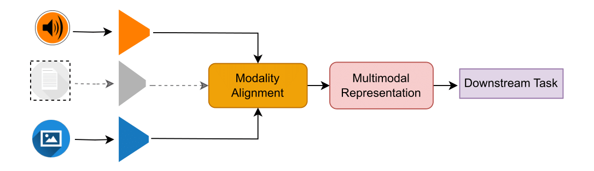</br>
  <em>Fig 6: High level overview of alignment methods for missing modality handling</em>
</p>

| Year | Title | Paper Link | Code Link |
|------|-------|------------|-----------|
| 2025 | Robust Multimodal Learning Via Cross-Modal Proxy Tokens | [📄](https://arxiv.org/pdf/2501.17823.pdf) | - |
| 2025 | Wasserstein Modality Alignment Makes Your Multimodal Transformer More Robust | [📄](https://scholars.cityu.edu.hk/en/publications/wasserstein-modality-alignment-makes-your-multimodal-transformer-) | - |
| 2024 | Multimodal Knowledge Graph Embedding With Missing Data Integration | [📄](https://ieeexplore.ieee.org/document/10539319) | - |
| 2024 | Penta-Encoder With Medical Transformer For Incomplete Multimodal Learning Of Brain Tumor Segmentation | [📄](https://ieeexplore.ieee.org/document/10846462) | - |
| 2023 | Rethinking Missing Modality Learning From A Decoding Perspective | [📄](https://dl.acm.org/doi/10.1145/3581783.3612291) | - |
| 2023 | Exploiting Multi-Modal Fusion For Robust Face Representation Learning With Missing Modality | [📄](https://link.springer.com/chapter/10.1007/978-3-031-44210-0_23) | - |
| 2023 | Multimodal Language Learning For Object Retrieval In Low Data Regimes In The Face Of Missing Modalities | [📄](https://ebiquity.umbc.edu/paper/html/id/1150/Multimodal-Language-Learning-for-Object-Retrieval-in-Low-Data-Regimes-in-the-Face-of-Missing-Modalities) | - |
| 2023 | Cross-Modal Alignment And Translation For Missing Modality Action Recognition | [📄](https://www.sciencedirect.com/science/article/abs/pii/S1077314223001856) | - |
| 2022 | Mm-Align: Learning Optimal Transport-Based Alignment Dynamics For Fast And Accurate Inference On Missing Modality Sequences | [📄](http://arxiv.org/pdf/2210.12798) | [💻](https://github.com/declare-lab/MM-Align) |
| 2022 | M3Care: Learning With Missing Modalities In Multimodal Healthcare Data | [📄](https://arxiv.org/pdf/2210.17292) | - |
| 2022 | A General Framework For Incomplete Cross-Modal Retrieval With Missing Labels And Missing Modalities | [📄](https://ieeexplore.ieee.org/document/9747813) | - |
| 2021 | A Non-Linear Mapping Representing Human Action Recognition Under Missing Modality Problem In Video Data | [📄](https://www.sciencedirect.com/science/article/abs/pii/S0263224121010411) | - |
| 2018 | Generalized Bayesian Canonical Correlation Analysis With Missing Modalities | [📄](https://link.springer.com/chapter/10.1007/978-3-030-11024-6_48) | - |

### 1.2 Architectural
### 1.2.1 Model Design [Back to Top](#table-of-contents)
<p align="center">
  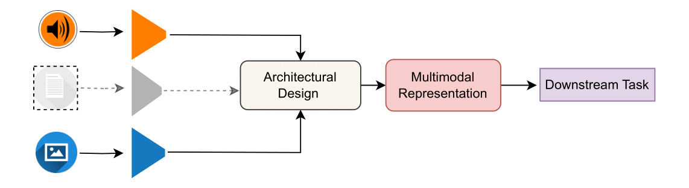</br>
  <em>Fig 7: High level overview of model based methods for missing modality handling</em>
</p>

| Year | Title | Paper Link | Code Link |
|------|-------|------------|-----------|
| 2025 | Uml: A Unified Multimodal Learning Framework For Cataract Postoperative Visual Acuity Prediction With Uncertain Missing Modalities | [📄](https://ieeexplore.ieee.org/document/10889124) | [💻](https://github.com/yty9941/Eyer-BCVA) |
| 2024 | Missing Modality Robustness In Semi-Supervised Multi-Modal Semantic Segmentation | [📄](https://arxiv.org/pdf/2304.10756) | [💻](https://github.com/harshm121/M3L) |
| 2024 | Mmmvit: Multiscale Multimodal Vision Transformer For Brain Tumor Segmentation With Missing Modalities | [📄](https://www.sciencedirect.com/science/article/abs/pii/S1746809423012600) | [💻](https://github.com/qiuchengjian/MMMViT) |
| 2024 | Robust Multimodal Learning With Missing Modalities Via Parameter-Efficient Adaptation | [📄](http://arxiv.org/pdf/2310.03986) | - |
| 2024 | Unibev: Multi-Modal 3D Object Detection With Uniform Bev Encoders For Robustness Against Missing Sensor Modalities | [📄](https://arxiv.org/pdf/2309.14516.pdf) | - |
| 2023 | Towards Good Practices For Missing Modality Robust Action Recognition | [📄](http://arxiv.org/pdf/2211.13916v2) | - |
| 2023 | M3Ae: Multimodal Representation Learning For Brain Tumor Segmentation With Missing Modalities | [📄](http://arxiv.org/pdf/2303.05302v1) | - |
| 2023 | Multi-Modal Learning With Missing Modality Via Shared-Specific Feature Modelling | [📄](http://arxiv.org/pdf/2307.14126) | - |
| 2022 | Smu-Net: Style Matching U-Net For Brain Tumor Segmentation With Missing Modalities | [📄](http://arxiv.org/pdf/2204.02961v1) | [💻](https://github.com/rezazad68/smunet) |
| 2022 | Moddrop++: A Dynamic Filter Network With Intra-Subject Co-Training For Multiple Sclerosis Lesion Segmentation With Missing Modalities | [📄](http://arxiv.org/pdf/2203.04959) | - |
| 2022 | Mmformer: Multimodal Medical Transformer For Incomplete Multimodal Learning Of Brain Tumor Segmentation | [📄](http://arxiv.org/pdf/2206.02425v2) | [💻](https://github.com/YaoZhang93/mmFormer) |
| 2021 | Maximum Likelihood Estimation For Multimodal Learning With Missing Modality | [📄](http://arxiv.org/pdf/2108.10513v1) | - |
| 2020 | Training Strategies To Handle Missing Modalities For Audio-Visual Expression Recognition | [📄](https://arxiv.org/pdf/2010.00734) | - |
| 2020 | Multimodal Biometrics Recognition From Facial Video With Missing Modalities Using Deep Learning | [📄](https://doi.org/10.5121/csit.2017.70107) | - |
| 2019 | A Unified Representation Network For Segmentation With Missing Modalities | [📄](http://arxiv.org/pdf/1908.06683v1) | - |
| 2019 | Audio Feature Generation For Missing Modality Problem In Video Action Recognition | [📄](https://ieeexplore.ieee.org/document/8682513) | - |
| 2019 | Brain Tumor Segmentation On Mri With Missing Modalities | [📄](http://arxiv.org/pdf/1904.07290v1) | - |

### 1.2.2 Selective Fusion [Back to Top](#table-of-contents)
<p align="center">
  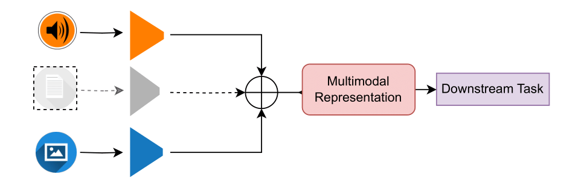</br>
  <em>Fig 8: High level overview of fusion based methods for missing modality handling</em>
</p>

| Year | Title | Paper Link | Code Link |
|------|-------|------------|-----------|
| 2023 | What Makes For Robust Multi-Modal Models In The Face Of Missing Modalities? | [📄](https://arxiv.org/pdf/2310.06383) | - |
| 2023 | Rethinking Uncertainly Missing And Ambiguous Visual Modality In Multi-Modal Entity Alignment | [📄](https://arxiv.org/pdf/2307.16210) | [💻](https://github.com/zjukg/UMAEA) |
| 2022 | Mitigating Inconsistencies In Multimodal Sentiment Analysis Under Uncertain Missing Modalities | [📄](https://aclanthology.org/2022.emnlp-main.189.pdf) | [💻](https://github.com/JaydenZeng/EMMR) |
| 2021 | Robust Multi-Modality Person Re-Identification | [📄](https://ojs.aaai.org/index.php/AAAI/article/download/16467/16274) | - |
| 2015 | Sparse Low-Rank Fusion Based Deep Features For Missing Modality Face Recognition | [📄](https://ieeexplore.ieee.org/document/7163103) | - |


### 1.2.3 Co-Learning [Back to Top](#table-of-contents)
<p align="center">
  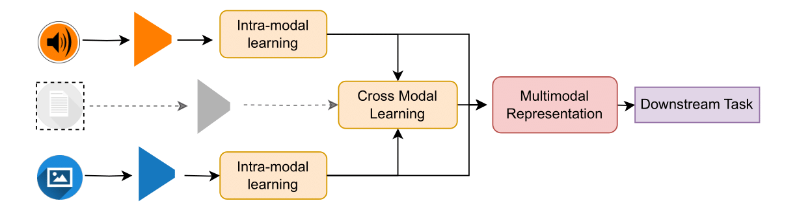</br>
  <em>Fig 9: High level overview of co-learning methods for missing modality handling</em>
</p>

| Year | Title | Paper Link | Code Link |
|------|-------|------------|-----------|
| 2023 | Multimodal Federated Learning With Missing Modality Via Prototype Mask And Contrast | [📄](http://arxiv.org/pdf/2312.13508v2) | [💻](https://github.com/Noirebao/Multimodal_Federated) |
| 2023 | Enhancing Modality-Agnostic Representations Via Meta-Learning For Brain Tumor Segmentation | [📄](https://www.ncbi.nlm.nih.gov/pmc/articles/PMC11087061) | - |
| 2023 | Missmodal: Increasing Robustness To Missing Modality In Multimodal Sentiment Analysis | [📄](https://direct.mit.edu/tacl/article-pdf/doi/10.1162/tacl_a_00628/2199592/tacl_a_00628.pdf) | [💻](https://github.com/RH-Lin/MissModal) |
| 2023 | Multimodal Reconstruct And Align Net For Missing Modality Problem In Sentiment Analysis | [📄](https://link.springer.com/chapter/10.1007/978-3-031-27818-1_34) | - |
| 2022 | Missing Modality Meets Meta Sampling (M3S): An Efficient Universal Approach For Multimodal Sentiment Analysis With Missing Modality | [📄](http://arxiv.org/pdf/2210.03428v1) | - |
| 2022 | D 2-Net: Dual Disentanglement Network For Brain Tumor Segmentation With Missing Modalities | [📄](https://ieeexplore.ieee.org/document/9775681) | [💻](https://github.com/CityU-AIM-Group/D2Net) |
| 2021 | An Efficient Approach For Audio-Visual Emotion Recognition With Missing Labels And Missing Modalities | [📄](https://ieeexplore.ieee.org/document/9428219) | - |
| 2021 | Smil: Multimodal Learning With Severely Missing Modality | [📄](http://arxiv.org/pdf/2103.05677v1) | - |
| 2021 | Deep Multisensor Learning For Missing-Modality All-Weather Mapping | [📄](https://www.sciencedirect.com/science/article/abs/pii/S0924271620303476) | - |
| 2021 | Progressive Modality Cooperation For Multi-Modality Domain Adaptation | [📄](https://arxiv.org/pdf/2506.19316.pdf) | - |
| 2021 | Acn: Adversarial Co-Training Network For Brain Tumor Segmentation With Missing Modalities | [📄](https://arxiv.org/pdf/2106.14591.pdf) | - |
| 2018 | Lrmm: Learning To Recommend With Missing Modalities | [📄](http://arxiv.org/pdf/1808.06791v2) | - |
| 2015 | Missing Modality Transfer Learning Via Latent Low-Rank Constraint | [📄](https://ieeexplore.ieee.org/document/7172522) | - |
| 2014 | Latent Low-Rank Transfer Subspace Learning For Missing Modality Recognition | [📄](https://ojs.aaai.org/index.php/AAAI/article/download/8905/8764) | - |

### 1.2.4 Distillation [Back to Top](#table-of-contents)
<p align="center">
  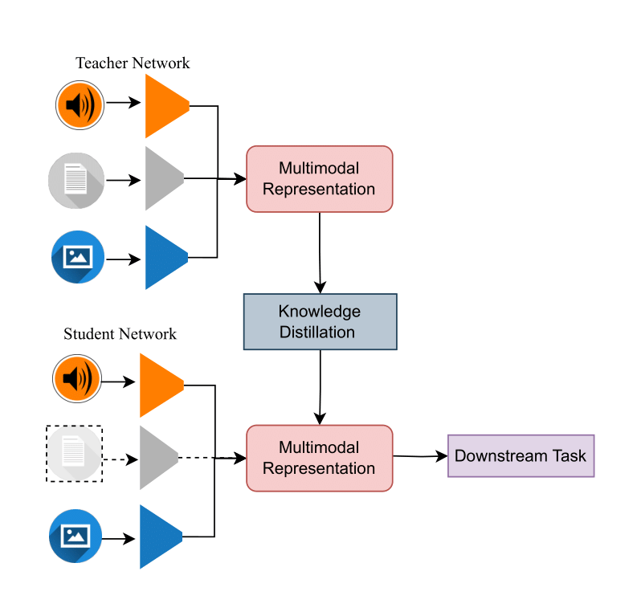</br>
  <em>Fig 10: High level overview of distillation methods for missing modality handling</em>
</p>


| Year | Title | Paper Link | Code Link |
|------|-------|------------|-----------|
| 2025 | Modalitymirror: Enhancing Audio Classification In Modality Heterogeneity Federated Learning Via Multimodal Distillation | [📄](https://arxiv.org/pdf/2408.15803.pdf) | - |
| 2025 | Modality-Invariant Bidirectional Temporal Representation Distillation Network For Missing Multimodal Sentiment Analysis | [📄](https://arxiv.org/pdf/2501.05474.pdf) | - |
| 2025 | Test-Time Adaptation For Combating Missing Modalities In Egocentric Videos | [📄](https://arxiv.org/abs/2404.15161) | - |
| 2024 | Segment Beyond View: Handling Partially Missing Modality For Audio-Visual Semantic Segmentation | [📄](https://arxiv.org/abs/2312.08673) | - |
| 2023 | Prototype Knowledge Distillation For Medical Segmentation With Missing Modality | [📄](http://arxiv.org/pdf/2303.09830v2) | [💻](https://github.com/SakurajimaMaiii/ProtoKD) |
| 2023 | Msh-Net: Modality-Shared Hallucination With Joint Adaptation Distillation For Remote Sensing Image Classification Using Missing Modalities | [📄](https://ieeexplore.ieee.org/document/10097714) | [💻](https://github.com/shicaiwei123/TGRS-MSHNet) |
| 2023 | Learnable Cross-Modal Knowledge Distillation For Multi-Modal Learning With Missing Modality | [📄](https://arxiv.org/pdf/2310.01035.pdf) | - |
| 2023 | Multi-Head Siamese Prototype Learning Against Both Data And Label Corruption | [📄](https://dl.acm.org/doi/10.1145/3595916.3626435) | - |
| 2021 | Dealing With Missing Modalities In The Visual Question Answer-Difference Prediction Task Through Knowledge Distillation | [📄](https://arxiv.org/pdf/2104.05965) | - |
| 2020 | Multimodal Learning With Incomplete Modalities By Knowledge Distillation | [📄](https://dl.acm.org/doi/pdf/10.1145/3394486.3403234) | - |
| 2019 | An Adversarial Approach To Discriminative Modality Distillation For Remote Sensing Image Classification | [📄](https://ieeexplore.ieee.org/document/9022062) | - |
| 2019 | Cross-Modal Learning By Hallucinating Missing Modalities In Rgb-D Vision | [📄](https://www.sciencedirect.com/science/article/abs/pii/B9780128173589000184) | [💻](https://github.com/ncgarcia/modality-distillation) |
| 2018 | Modality Distillation With Multiple Stream Networks For Action Recognition | [📄](http://arxiv.org/pdf/1806.07110v2) | - |

### 1.2.5 Attention Mechanism [Back to Top](#table-of-contents)
<p align="center">
  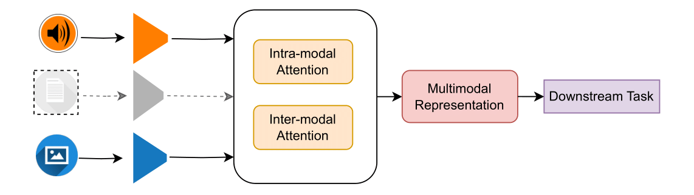</br>
  <em>Fig 11: High level overview of attention methods for missing modality handling</em>
</p>

| Year | Title | Paper Link | Code Link |
|------|-------|------------|-----------|
| 2024 | Mman-M2: Multiple Multi-Head Attentions Network Based On Encoder With Missing Modalities | [📄](https://www.sciencedirect.com/science/article/abs/pii/S0167865523003458) | - |
| 2024 | Framm: Fair Ranking With Missing Modalities For Clinical Trial Site Selection | [📄](http://arxiv.org/pdf/2305.19407v1) | - |
| 2023 | Accommodating Missing Modalities In Time-Continuous Multimodal Emotion Recognition | [📄](http://arxiv.org/pdf/2311.10119) | - |
| 2023 | Attention-Based Multimodal Fusion With Contrast For Robust Clinical Prediction In The Face Of Missing Modalities | [📄](https://doi.org/10.1016/j.jbi.2023.104466) | - |
| 2023 | Magnet: Modality-Agnostic Network For Brain Tumor Segmentation And Characterization With Missing Modalities | [📄](https://link.springer.com/chapter/10.1007/978-3-031-45673-2_36) | - |
| 2023 | Contrastive Learning-Based Spectral Knowledge Distillation For Multi-Modality And Missing Modality Scenarios In Semantic Segmentation | [📄](https://arxiv.org/pdf/2312.02240.pdf) | - |
| 2023 | Audio-Visual Sensor Fusion Framework Using Person Attributes Robust To Missing Visual Modality For Person Recognition | [📄](https://link.springer.com/chapter/10.1007/978-3-031-27818-1_43) | - |
| 2022 | Tag-Assisted Multimodal Sentiment Analysis Under Uncertain Missing Modalities | [📄](https://arxiv.org/pdf/2204.13707) | [💻](https://github.com/JaydenZeng/TATE) |
| 2022 | A Multimodal Sensor Fusion Framework Robust To Missing Modalities For Person Recognition | [📄](http://arxiv.org/pdf/2210.10972v2) | - |
| 2022 | Multi-Modal Brain Tumor Segmentation Via Missing Modality Synthesis And Modality-Level Attention Fusion | [📄](http://arxiv.org/pdf/2203.04586) | - |
| 2022 | Robust Multimodal Sentiment Analysis Via Tag Encoding Of Uncertain Missing Modalities | [📄](https://ieeexplore.ieee.org/document/9894726) | - |
| 2022 | Multimodal Image Aesthetic Prediction With Missing Modality | [📄](https://www.mdpi.com/2227-7390/10/13/2312/pdf?version=1657078622) | - |
| 2022 | Modality-Adaptive Feature Interaction For Brain Tumor Segmentation With Missing Modalities | [📄](https://link.springer.com/chapter/10.1007/978-3-031-16443-9_18) | - |
| 2021 | Multimodal Gait Recognition Under Missing Modalities | [📄](https://hal-polytechnique.archives-ouvertes.fr/hal-03353572/file/ICIP_2021_Multimodal_Gait_Recognition_Under_Missing_Modalities.pdf) | [💻](https://github.com/avagait/gaitmiss) |
| 2020 | Multi-Modality Matters: A Performance Leap On Voxceleb. | [📄](https://www.isca-archive.org/interspeech_2020/chen20h_interspeech.pdf) | [💻](https://github.com/SRavit1/multimodal_biometric_authentication) |
| 2020 | Brain Tumor Segmentation With Missing Modalities Via Latent Multi-Source Correlation Representation | [📄](https://arxiv.org/abs/2003.08870) | - |

### 1.2.6 Prompt Learning [Back to Top](#table-of-contents)
<p align="center">
  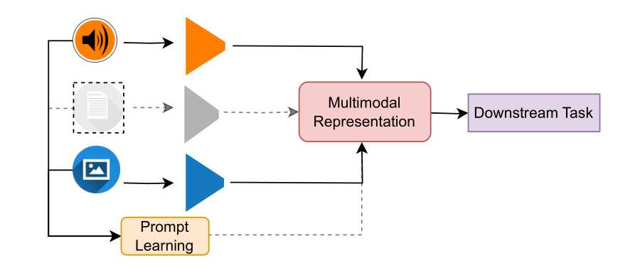</br>
  <em>Fig 12: High level overview of prompt learning methods for missing modality handling</em>
</p>

| Year | Title | Paper Link | Code Link |
|------|-------|------------|-----------|
| 2025 | Retrieval-Augmented Dynamic Prompt Tuning For Incomplete Multimodal Learning | [📄](https://arxiv.org/pdf/2501.01120.pdf) | - |
| 2025 | Efficient Prompting For Continual Adaptation To Missing Modalities | [📄](http://arxiv.org/pdf/2503.00528v1) | - |
| 2025 | Multimodal Invariant Feature Prompt Network For Brain Tumor Segmentation With Missing Modalities | [📄](https://www.sciencedirect.com/science/article/abs/pii/S0925231224016187) | [💻](https://github.com/diaoyq121/MIFPN) |
| 2025 | Pal: Prompting Analytic Learning With Missing Modality For Multi-Modal Class-Incremental Learning | [📄](https://arxiv.org/pdf/2501.09352.pdf) | - |
| 2025 | Semantically Conditioned Prompts For Visual Recognition Under Missing Modality Scenarios | [📄](https://ieeexplore.ieee.org/stamp/stamp.jsp?arnumber=10944153) | [💻](https://github.com/vittoriopipoli/SCP_WACV2025) |
| 2024 | Towards Robust Multimodal Prompting With Missing Modalities | [📄](http://arxiv.org/pdf/2312.15890v2) | - |
| 2023 | Multimodal Prompting With Missing Modalities For Visual Recognition | [📄](http://arxiv.org/pdf/2303.03369v2) | [💻](https://github.com/YiLunLee/missing_aware_prompts) |

### 1.3 Hybrid Appraoches [Back to Top](#table-of-contents)
<p align="center">
  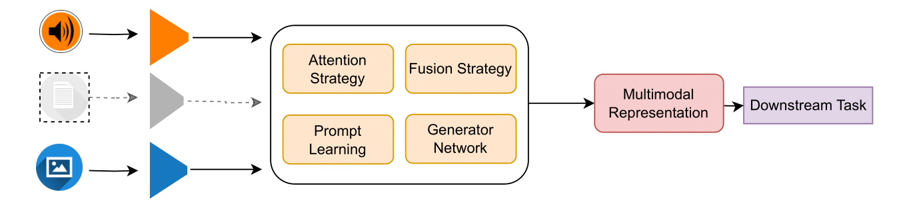</br>
  <em>Fig 13: High level overview of Hybrid methods for missing modality handling</em>
</p>

| Year | Title | Paper Link | Code Link |
|------|-------|------------|-----------|
| 2025 | Cross-Modal Prototype Based Multimodal Federated Learning Under Severely Missing Modality | [📄](https://arxiv.org/abs/2401.13898) | - |
| 2025 | Graph Attention Contrastive Learning With Missing Modality For Multimodal Recommendation | [📄](https://www.sciencedirect.com/science/article/abs/pii/S0950705125000826) | - |
| 2025 | Fedmobile: Enabling Knowledge Contribution-Aware Multi-Modal Federated Learning With Incomplete Modalities | [📄](https://www.arxiv.org/abs/2502.15839) | - |
| 2025 | Incomplete Modality Disentangled Representation For Ophthalmic Disease Grading And Diagnosis | [📄](https://arxiv.org/pdf/2502.11724.pdf) | [💻](https://github.com/Chenngzz/IMDR) |
| 2025 | Ssfd-Net: Shared-Specific Feature Disentanglement Network For Multimodal Biometric Recognition With Missing Modality | [📄](https://www.sciencedirect.com/science/article/abs/pii/S1051200425000259) | - |
| 2025 | Diffusion-Driven Incomplete Multimodal Learning For Air Quality Prediction | [📄](https://dl.acm.org/doi/pdf/10.1145/3702243) | - |
| 2025 | Ogp-Net: Optical Guidance Meets Pixel-Level Contrastive Distillation For Robust Multi-Modal And Missing Modality Segmentation | [📄](https://ojs.aaai.org/index.php/AAAI/article/view/32743) | - |
| 2025 | Multimodal Sentiment Analysis Based On Multi-Stage Graph Fusion Networks Under Random Missing Modality Conditions | [📄](https://ietresearch.onlinelibrary.wiley.com/doi/10.1049/ipr2.13310) | - |
| 2025 | Text-Guided Reconstruction Network For Sentiment Analysis With Uncertain Missing Modalities | [📄](https://ieeexplore.ieee.org/document/10884915) | - |
| 2025 | Open-Modality Latent Modality Interaction Maximization For Audio-Visual Learning | [📄](https://ieeexplore.ieee.org/abstract/document/10890569) | - |
| 2025 | Disentangling And Generating Modalities For Recommendation In Missing Modality Scenarios | [📄](http://arxiv.org/pdf/2504.16352v1) | - |
| 2025 | Optimus: Predicting Multivariate Outcomes In Alzheimer'S Disease Using Multi-Modal Data Amidst Missing Values | [📄](https://arxiv.org/pdf/2503.11282.pdf) | - |
| 2025 | Tackling Real-World Complexity: Hierarchical Modeling And Dynamic Prompting For Multimodal Long Document Classification | [📄](https://ieeexplore.ieee.org/document/10869505) | - |
| 2025 | Mi-Cga: Cross-Modal Graph Attention Network For Robust Emotion Recognition In The Presence Of Incomplete Modalities | [📄](https://www.sciencedirect.com/science/article/abs/pii/S0925231225000141) | [💻](https://github.com/dangkh/Mi-CGA) |
| 2025 | Emotional Boundaries And Intensity Aware Model For Incomplete Multimodal Sentiment Analysis | [📄](https://www.sciencedirect.com/science/article/abs/pii/S1051200425000454) | - |
| 2025 | Adaptive Cross-Modal Representation Learning For Heterogeneous Data Types In Alzheimer Disease Progression Prediction With Missing Time Point And Modalities | [📄](https://link.springer.com/chapter/10.1007/978-3-031-78198-8_18) | - |
| 2024 | Modality Translation-Based Multimodal Sentiment Analysis Under Uncertain Missing Modalities | [📄](https://www.sciencedirect.com/science/article/abs/pii/S1566253523002890) | - |
| 2024 | Tip: Tabular-Image Pre-Training For Multimodal Classification With Incomplete Data | [📄](https://arxiv.org/pdf/2407.07582.pdf) | [💻](https://github.com/siyi-wind/TIP) |
| 2023 | Feature Fusion And Latent Feature Learning Guided Brain Tumor Segmentation And Missing Modality Recovery Network | [📄](https://www.sciencedirect.com/science/article/abs/pii/S0031320323003667) | - |
| 2022 | Are Multimodal Transformers Robust To Missing Modality? | [📄](http://arxiv.org/pdf/2204.05454v1) | - |
| 2021 | Ugaitnet: Multimodal Gait Recognition With Missing Input Modalities | [📄](https://ieeexplore.ieee.org/abstract/document/9634027) | [💻](https://github.com/avagait/ugaitnet) |
| 2018 | Semi-Supervised Deep Generative Modelling Of Incomplete Multi-Modality Emotional Data | [📄](https://arxiv.org/pdf/1808.02096) | - |
| 2018 | Urban Land Cover Classification With Missing Data Modalities Using Deep Convolutional Neural Networks | [📄](http://arxiv.org/pdf/1709.07383v2) | - |

## Multimodal Learning with Corrupted Modalities

<p align="center">
  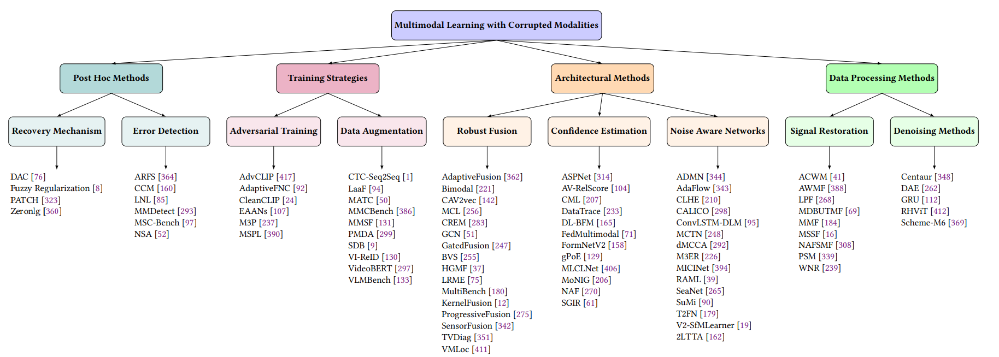</br>
  <em>Fig 14:  Overview of our corrupted modality taxonomy with SOTA methods Modalities</em>
</p>


<p align="center">
  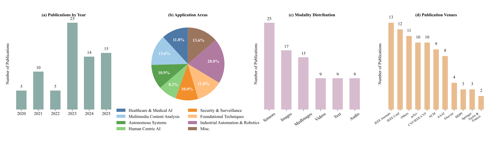</br>
  <em>Fig 15:  Overview of the existing studies on multimodal learning under corrupted modalities, showing (a) yearly publication trends, (b) application areas, (c) modality distribution, and (d) publication venues</em>
</p>


### 2.1 Data Processing Methods
### 2.1.1 Denoising Methods [Back to Top](#table-of-contents)

<p align="center">
  </br>
  <em>Fig 16: High level overview of Hybrid methods for corrupted modality handling</em>
</p>

| Year | Title | Paper Link | Code Link |
|------|-------|------------|-----------|
| 2024 | Centaur: Robust Multimodal Fusion For Human Activity Recognition | [📄](http://arxiv.org/pdf/2303.04636) | - |
| 2023 | Rhvit: A Robust Hierarchical Transformer For 3D Multimodal Brain Tumor Segmentation Using Biased Masked Image Modeling Pre-Training | [📄](https://ieeexplore.ieee.org/document/10385746) | - |
| 2022 | Multimodal Cloud Resources Utilization Forecasting Using A Bidirectional Gated Recurrent Unit Predictor Based On A Power Efficient Stacked Denoising Autoencoders | [📄](https://doi.org/10.1016/j.aej.2022.05.017) | - |
| 2018 | Highly Accurate Image Reconstruction For Multimodal Noise Suppression Using Semisupervised Learning On Big Data | [📄](https://ieeexplore.ieee.org/document/8327853) | [💻](https://github.com/bigmms/semisupervised-learning-denoising) |
| 2014 | Multimodal Learning For Autonomous Underwater Vehicles From Visual And Bathymetric Data | [📄](https://www.researchgate.net/publication/286680050_Multimodal_learning_for_autonomous_underwater_vehicles_from_visual_and_bathymetric_data) | - |

### 2.2 Architectural Methods

<p align="center">
  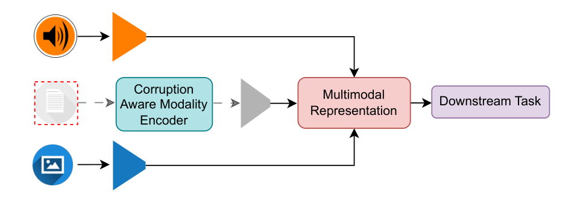</br>
  <em>Fig 17: High level overview of architectural methods for corrupted modality handling</em>
</p>


### 2.2.1 Noise Aware Networks [Back to Top](#table-of-contents)
| Year | Title | Paper Link | Code Link |
|------|-------|------------|-----------|
| 2025 | V 2-Sfmlearner: Learning Monocular Depth And Ego-Motion For Multimodal Wireless Capsule Endoscopy | [📄](https://doi.org/10.1109/tase.2025.3530791) | - |
| 2025 | Micinet: Multi-Level Inter-Class Confusing Information Removal For Reliable Multimodal Classification | [📄](https://arxiv.org/pdf/2502.19674.pdf) | - |
| 2025 | Smoothing The Shift: Towards Stable Test-Time Adaptation Under Complex Multimodal Noises | [📄](https://arxiv.org/pdf/2503.02616.pdf) | - |
| 2025 | Admn: A Layer-Wise Adaptive Multimodal Network For Dynamic Input Noise And Compute Resources | [📄](https://arxiv.org/pdf/2502.07862.pdf) | - |
| 2024 | Two-Level Test-Time Adaptation In Multimodal Learning | [📄](https://openreview.net/pdf?id=n0lDbIKVAT) | - |
| 2024 | Leveraging Multimodal Features And Item-Level User Feedback For Bundle Construction | [📄](https://dl.acm.org/doi/pdf/10.1145/3616855.3635854) | [💻](https://github.com/Xiaohao-Liu/CLHE) |
| 2024 | Adaflow: Non-Blocking Inference With Heterogeneous Multi-Modal Mobile Sensor Data | [📄](https://www.computer.org/csdl/proceedings-article/cscaiot/2024/633800a008/1YTs5ZPRwhW) | - |
| 2023 | Redundancy-Adaptive Multimodal Learning For Imperfect Data | [📄](https://arxiv.org/pdf/2310.14496.pdf) | - |
| 2023 | Calico: Self-Supervised Camera-Lidar Contrastive Pre-Training For Bev Perception | [📄](http://arxiv.org/pdf/2306.00349) | - |
| 2022 | Efficient Multimodal Deep-Learning-Based Covid-19 Diagnostic System For Noisy And Corrupted Images | [📄](https://doi.org/10.1016/j.jksus.2022.101898) | - |
| 2020 | M3Er: Multiplicative Multimodal Emotion Recognition Using Facial, Textual, And Speech Cues | [📄](http://arxiv.org/pdf/1911.05659v2) | - |
| 2020 | Seanet: A Multi-Modal Speech Enhancement Network | [📄](https://arxiv.org/pdf/2009.02095) | - |
| 2019 | Found In Translation: Learning Robust Joint Representations By Cyclic Translations Between Modalities | [📄](http://arxiv.org/pdf/1812.07809v2) | - |
| 2019 | Learning Representations From Imperfect Time Series Data Via Tensor Rank Regularization | [📄](http://arxiv.org/pdf/1907.01011v1) | - |
| 2019 | Multimodal Representation Learning Using Deep Multiset Canonical Correlation | [📄](http://arxiv.org/pdf/1904.01775v1) | - |

### 2.2.2 Confidence Estimation [Back to Top](#table-of-contents)
| Year | Title | Paper Link | Code Link |
|------|-------|------------|-----------|
| 2025 | Deep Learning-Driven Behavioral Modeling In Iost For Mental Health Monitoring And Intervention | [📄](https://ieeexplore.ieee.org/document/10943187) | - |
| 2023 | Calibrating Multimodal Learning | [📄](http://arxiv.org/pdf/2306.01265v1) | - |
| 2023 | Fedmultimodal: A Benchmark For Multimodal Federated Learning | [📄](http://arxiv.org/pdf/2306.09486v2) | - |
| 2023 | Multi-Level Confidence Learning For Trustworthy Multimodal Classification | [📄](https://ojs.aaai.org/index.php/AAAI/article/download/26346/26118) | - |
| 2023 | Watch Or Listen: Robust Audio-Visual Speech Recognition With Visual Corruption Modeling And Reliability Scoring | [📄](https://arxiv.org/pdf/2303.08536) | [💻](https://github.com/joannahong/AV-RelScore) |
| 2023 | Formnetv2: Multimodal Graph Contrastive Learning For Form Document Information Extraction | [📄](http://arxiv.org/pdf/2305.02549v2) | - |
| 2023 | Sgir: Star Graph-Based Interaction For Efficient And Robust Multimodal Representation | [📄](https://ieeexplore.ieee.org/document/10269037) | - |
| 2023 | Aspnet: Action Segmentation With Shared-Private Representation Of Multiple Data Sources | [📄](http://openaccess.thecvf.com/content/CVPR2023/papers/van_Amsterdam_ASPnet_Action_Segmentation_With_Shared-Private_Representation_of_Multiple_Data_Sources_CVPR_2023_paper.pdf) | - |
| 2022 | Generalized Product-Of-Experts For Learning Multimodal Representations In Noisy Environments | [📄](https://arxiv.org/pdf/2211.03587) | - |
| 2021 | Trustworthy Multimodal Regression With Mixture Of Normal-Inverse Gamma Distributions | [📄](https://arxiv.org/pdf/2111.08456.pdf) | [💻](https://github.com/MaHuanAAA/MoNIG) |
| 2021 | Multimodal Attention Fusion For Target Speaker Extraction | [📄](http://arxiv.org/pdf/2102.01326v1) | - |
| 2019 | Anomaly Detection From System Tracing Data Using Multimodal Deep Learning | [📄](https://netman.aiops.org/~peidan/ANM2019/7.TraceAnomalyDetection/LectureCoverage/2019IEEECloud_Anomaly%20Detection%20from%20Tracing%20Data%20using%20Multimodal%20Deep%20Learning.pdf) | - |

### 2.2.3 Robust Fusion [Back to Top](#table-of-contents)
| Year | Title | Paper Link | Code Link |
|------|-------|------------|-----------|
| 2025 | Multi-Task Corrupted Prediction For Learning Robust Audio-Visual Speech Representation | [📄](https://arxiv.org/pdf/2504.18539.pdf) | - |
| 2024 | Learning Rich Multimodal Representation For Robust Land Cover Classification In Fog | [📄](https://ieeexplore.ieee.org/document/10438384) | - |
| 2024 | Tvdiag: A Task-Oriented And View-Invariant Failure Diagnosis Framework With Multimodal Data | [📄](https://arxiv.org/pdf/2407.19711.pdf) | - |
| 2024 | Indoor Scene Recognition From Images Under Visual Corruptions | [📄](http://arxiv.org/pdf/2408.13029v1) | - |
| 2023 | Low-Rank Multimanifold Embedding Learning For Multimode Process Monitoring | [📄](https://ieeexplore.ieee.org/document/10244242) | - |
| 2023 | Employing Multimodal Co-Learning To Evaluate The Robustness Of Sensor Fusion For Industry 5.0 Tasks | [📄](https://link.springer.com/article/10.1007/s00500-022-06802-9) | - |
| 2023 | Toward A Robust Sensor Fusion Step For 3D Object Detection On Corrupted Data | [📄](http://arxiv.org/pdf/2306.07344v1) | - |
| 2022 | Progressive Fusion For Multimodal Integration | [📄](http://arxiv.org/pdf/2209.00302v2) | - |
| 2021 | Multibench: Multiscale Benchmarks For Multimodal Representation Learning | [📄](http://arxiv.org/pdf/2107.07502v2) | - |
| 2021 | Vmloc: Variational Fusion For Learning-Based Multimodal Camera Localization | [📄](https://ojs.aaai.org/index.php/AAAI/article/download/16767/16574) | [💻](https://github.com/kaichen-z/VMLoc) |
| 2020 | Hgmf: Heterogeneous Graph-Based Fusion For Multimodal Data With Incompleteness | [📄](http://www.shichuan.org/hin/topic/Information%20Fusion/KDD2020.HGMF_Heterogeneous%20Graph-based%20Fusion%20for%20Multimodal%20Data%20with%20Incompleteness.pdf) | - |
| 2020 | Adaptive Multimodal Fusion For Facial Action Units Recognition | [📄](https://dl.acm.org/doi/pdf/10.1145/3394171.3413538) | - |
| 2019 | A Deep Learning Gated Architecture For Ugv Navigation Robust To Sensor Failures | [📄](https://www.sciencedirect.com/science/article/am/pii/S0921889018305645) | - |

### 2.3 Training Strategies

<p align="center">
  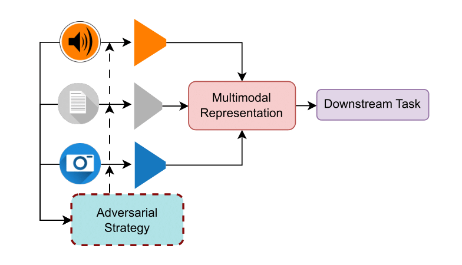</br>
  <em>Fig 18: High level overview of training strategies for corrupted modality handling</em>
</p>


### 2.3.1 Data Augmentation [Back to Top](#table-of-contents)
| Year | Title | Paper Link | Code Link |
|------|-------|------------|-----------|
| 2025 | Fusion For Visual-Infrared Person Reid In Real-World Surveillance Using Corrupted Multimodal Data | [📄](http://arxiv.org/pdf/2305.00320) | - |
| 2024 | The Effect Of Data Corruption On Multimodal Long Form Responses | [📄](https://openreview.net/pdf?id=wP97TI4OEq) | - |
| 2024 | Benchmarking Large Multimodal Models Against Common Corruptions | [📄](http://arxiv.org/pdf/2401.11943v1) | - |
| 2024 | Robust Visible-Infrared Person Re-Identification Based On Polymorphic Mask And Wavelet Graph Convolutional Network | [📄](https://ieeexplore.ieee.org/document/10400493) | - |
| 2023 | Masking Important Information To Assess The Robustness Of A Multimodal Classifier For Emotion Recognition | [📄](https://www.frontiersin.org/articles/10.3389/frai.2023.1091443/pdf) | - |
| 2023 | Multimodal Data Augmentation For Visual-Infrared Person Reid With Corrupted Data | [📄](https://arxiv.org/pdf/2211.11925) | - |
| 2023 | Multimodal Synthetic Dataset Balancing: A Framework For Realistic And Balanced Training Data Generation In Industrial Settings | [📄](https://ieeexplore.ieee.org/document/10311948) | - |
| 2023 | Best Of Both Worlds: Multimodal Contrastive Learning With Tabular And Imaging Data | [📄](http://arxiv.org/pdf/2303.14080v3) | - |
| 2019 | Videobert: A Joint Model For Video And Language Representation Learning | [📄](http://arxiv.org/pdf/1904.01766v2) | - |
| 2018 | Deep Audio-Visual Speech Recognition | [📄](https://arxiv.org/pdf/1809.02108) | [💻](https://github.com/smeetrs/deep_avsr) |

### 2.3.2 Adversarial Training [Back to Top](#table-of-contents)
| Year | Title | Paper Link | Code Link |
|------|-------|------------|-----------|
| 2023 | Cleanclip: Mitigating Data Poisoning Attacks In Multimodal Contrastive Learning | [📄](http://arxiv.org/pdf/2303.03323v3) | [💻](https://github.com/nishadsinghi/CleanCLIP) |
| 2023 | Multi-Head Siamese Prototype Learning Against Both Data And Label Corruption | [📄](https://dl.acm.org/doi/pdf/10.1145/3595916.3626435) | - |
| 2023 | Advclip: Downstream-Agnostic Adversarial Examples In Multimodal Contrastive Learning | [📄](https://arxiv.org/pdf/2308.07026) | - |
| 2023 | Contrastive Self-Supervised Learning Leads To Higher Adversarial Susceptibility | [📄](https://ojs.aaai.org/index.php/AAAI/article/download/26733/26505) | - |
| 2021 | Robust Multimodal Representation Learning With Evolutionary Adversarial Attention Networks | [📄](https://e-space.mmu.ac.uk/627675/1/IEEE%20TEVC-Feiran.pdf) | - |
| 2021 | M3P: Learning Universal Representations Via Multitask Multilingual Multimodal Pre-Training | [📄](https://arxiv.org/pdf/2006.02635) | - |

### 2.4 Post Hoc Methods

<p align="center">
  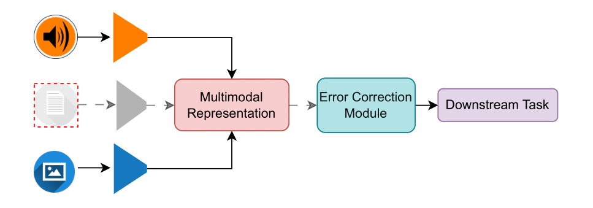</br>
  <em>Fig 19: High level overview of post-hoc strategies for corrupted modality handling</em>
</p>


### 2.4.1 Error Detection [Back to Top](#table-of-contents)
| Year | Title | Paper Link | Code Link |
|------|-------|------------|-----------|
| 2025 | Corrupted But Not Broken: Rethinking The Impact Of Corrupted Data In Visual Instruction Tuning | [📄](https://arxiv.org/pdf/2502.12635.pdf) | - |
| 2025 | Msc-Bench: Benchmarking And Analyzing Multi-Sensor Corruption For Driving Perception | [📄](https://arxiv.org/pdf/2501.01037.pdf) | - |
| 2024 | Both Text And Images Leaked! A Systematic Analysis Of Multimodal Llm Data Contamination | [📄](http://arxiv.org/pdf/2411.03823v2) | - |
| 2021 | Detect, Reject, Correct: Crossmodal Compensation Of Corrupted Sensors | [📄](http://arxiv.org/pdf/2012.00201v1) | - |
| 2021 | An Immune Inspired Algorithm For Fault Tolerant Enhanced Multimodal Machine Learning | [📄](https://ieeexplore.ieee.org/document/9669293) | - |
| 2021 | Defending Multimodal Fusion Models Against Single-Source Adversaries | [📄](http://arxiv.org/pdf/2206.12714) | - |

### 2.4.2 Recovery Mechanism [Back to Top](#table-of-contents)
| Year | Title | Paper Link | Code Link |
|------|-------|------------|-----------|
| 2024 | Zeronlg: Aligning And Autoencoding Domains For Zero-Shot Multimodal And Multilingual Natural Language Generation | [📄](https://arxiv.org/pdf/2303.06458) | [💻](https://github.com/yangbang18/ZeroNLG) |
| 2024 | Dac: 2D-3D Retrieval With Noisy Labels Via Divide-And-Conquer Alignment And Correction | [📄](http://arxiv.org/pdf/2407.17779) | - |
| 2023 | Patch: A Plug-In Framework Of Non-Blocking Inference For Distributed Multimodal System | [📄](https://cse.msu.edu/~caozc/papers/imwut23-wang.pdf) | - |
| 2023 | Deep Multimodal Fusion With Corrupted Spatio-Temporal Data Using Fuzzy Regularization | [📄](https://ieeexplore.ieee.org/document/10312522) | - |


## License

This repository is licensed under the MIT License - see the [LICENSE](LICENSE) file for details.

The papers listed in this repository are copyrighted by their respective authors and publishers.

## Citation

If you find the listing and survey useful for your work, please cite the paper:

```
@misc{liaqat2025multimodal,
      title={Multimodal learning with imperfect data: A Survey}, 
      author={Muhamamd Irzam Liaqat, Qaiser Abbas, Shah Nawaz, Zaigham Zaheer, Marta Moscati, Yufang Hou, Muhammad Haris Khan, Salman Khan, Elisabeth Andre, Markus Schedl}
      year={2025},
      eprint={},
      archivePrefix={arXiv},
      primaryClass={cs.CV}
}
```
